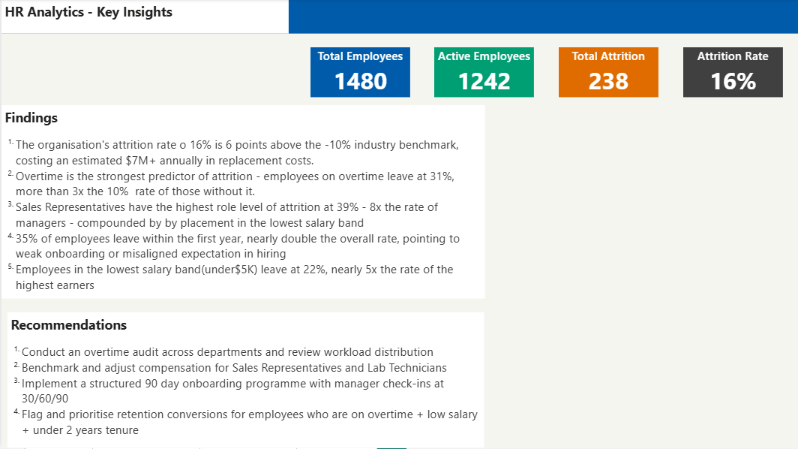
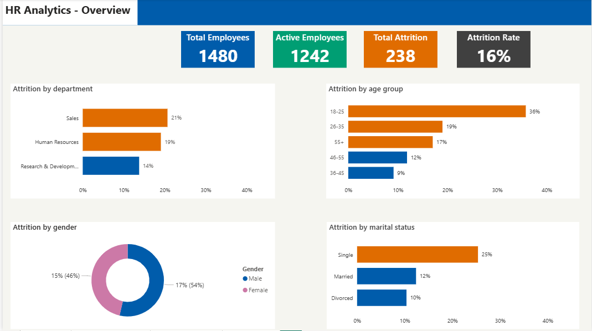
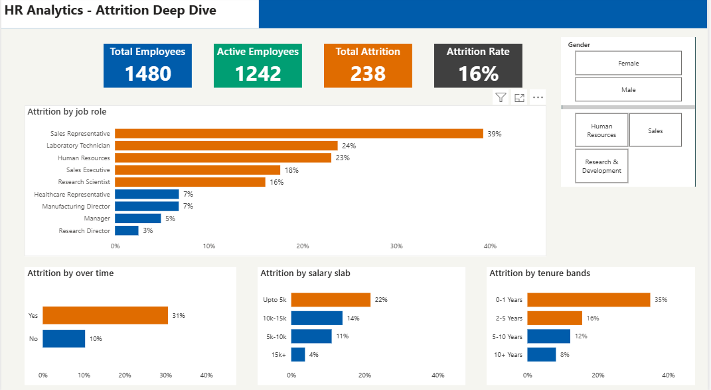
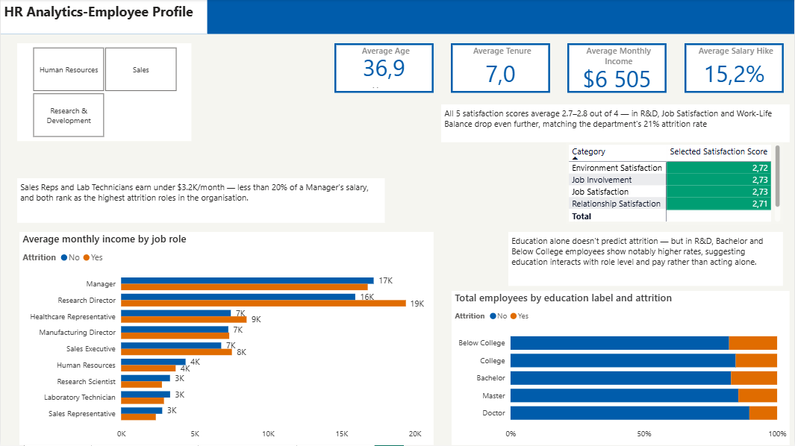

# HR Analytics — Employee Attrition Dashboard


## Overview

This project analyses employee attrition across a 1,480-person organisation using Power BI. The dashboard identifies key drivers behind the company's **16% attrition rate** — 6 points above the ~10% industry benchmark — and surfaces actionable recommendations for HR leadership. The analysis covers overtime patterns, role-level risk, salary bands, tenure, and satisfaction scores across three departments.

## 🔗 Live Dashboard

> [View on Power BI Service](YOUR_POWER_BI_LINK_HERE) ← replace with your published link

---

## Screenshots

### Key Insights


### Overview


### Attrition Deep-Dive


### Employee Profile


---

## Dataset

| Field | Detail |
|---|---|
| Source | IBM HR Analytics Employee Attrition |
| Rows | 1,480 employee records |
| Columns | 38 features |
| Key fields | Attrition, Department, Job Role, Monthly Income, OverTime, Satisfaction scores, Years At Company |

---

## Tools Used

- **Power BI Desktop** — dashboard design, report layout, visual formatting
- **Power Query** — data cleaning, column transformations, calculated columns
- **DAX** — KPI measures, attrition rate, satisfaction averages, conditional aggregations

---

## Data Cleaning Steps

The following transformations were applied in Power Query before modelling:

- Removed 3 constant columns — `EmployeeCount`, `Over18`, and `StandardHours` (identical value across all rows)
- Decoded the `Education` column from numeric codes (1–5) to readable labels: Below College, College, Bachelor, Master, Doctor
- Imputed 57 null values in `YearsWithCurrManager` with the column median (3) — chosen over the mean due to right skew in the distribution
- Created an `AttritionFlag` calculated column (1 = left, 0 = stayed) to enable SUM-based DAX measures
- Built a `Tenure Band` column bucketing `YearsAtCompany` into four groups: 0–1 Years, 2–5 Years, 6–10 Years, 10+ Years
- Added `Tenure Sort` and `Salary Sort` helper columns to enforce correct chart ordering (bypassing Power BI's default alphabetical sort)

---

## DAX Measures

All measures are stored in a dedicated `_Measures` table:

```dax
Total Employees = COUNTROWS(HR_Analytics)

Total Attrition = SUM(HR_Analytics[Attrition Flag])

Active Employees = [Total Employees] - [Total Attrition]

Attrition Rate % = DIVIDE([Total Attrition], [Total Employees], 0)

Overtime Attrition % =
    DIVIDE(
        CALCULATE([Total Attrition], HR_Analytics[OverTime] = "Yes"),
        CALCULATE([Total Employees], HR_Analytics[OverTime] = "Yes"),
        0
    )

Avg Monthly Income = AVERAGE(HR_Analytics[Monthly Income])

Avg Age = AVERAGE(HR_Analytics[Age])

Avg Tenure = AVERAGE(HR_Analytics[Years At Company])

Avg Job Satisfaction = AVERAGE(HR_Analytics[Job Satisfaction])

Avg Environment Satisfaction = AVERAGE(HR_Analytics[Environment Satisfaction])

Avg Work Life Balance = AVERAGE(HR_Analytics[Work Life Balance])

Avg Salary Hike % = DIVIDE(AVERAGE(HR_Analytics[Percent Salary Hike]), 100)
```

---

## Dashboard Pages

### 1. Key Insights *(executive summary — first page)*
Top findings and HR recommendations in plain language. No charts — designed for a decision-maker who needs the story in 30 seconds.

### 2. Overview
Headline KPI cards (Total Employees, Active Employees, Total Attrition, Attrition Rate %) with breakdown charts by Department, Age Group, Gender, and Marital Status.

### 3. Attrition Deep-Dive
Root cause analysis with four interactive charts:
- Attrition by Job Role (sorted descending)
- Overtime vs Attrition Rate
- Attrition by Tenure Band
- Attrition by Salary Slab

Includes Department and Gender slicers that filter all visuals simultaneously.

### 4. Employee Profile
Workforce composition page covering satisfaction scores (Job, Environment, Work-Life Balance, Involvement, Relationship), income distribution by job role, and education level breakdown — all filterable by department.

---

## Key Findings

1. **16% overall attrition** — 6 points above the ~10% industry average, estimated to cost $7M+ annually in replacement costs
2. **Overtime is the strongest predictor** — employees on overtime leave at 31%, more than 3× the 10% rate of non-overtime employees
3. **Sales Representatives have the highest role-level attrition at 39%** — 8× the rate of Managers (5%), compounded by placement in the lowest salary band
4. **35% of employees leave within their first year** — nearly double the overall rate, pointing to weak onboarding or misaligned hiring expectations
5. **Lowest salary band (under $5k/month) shows 22% attrition** — nearly 6× the 5% rate of the highest earners ($15k+)

---

## Recommendations

| Priority | Recommendation | Linked Finding |
|---|---|---|
| High | Conduct an overtime audit — identify and redistribute overloaded teams | Finding 2 |
| High | Benchmark and adjust compensation for Sales Representatives and Lab Technicians | Finding 3 & 5 |
| Medium | Implement a structured 90-day onboarding programme with manager check-ins at 30/60/90 days | Finding 4 |
| Medium | Flag and prioritise retention conversations for high-risk profiles: overtime + low salary + under 2 years tenure | Findings 2, 3, 4, 5 |

---

## Project Structure

```
hr-attrition-powerbi-analysis/
├── README.md
├── Dashboard.pbix
├── HR_Analytics.csv
├── screenshots/
│   ├── key-insights.png
│   ├── overview.png
│   ├── attrition-deep-dive.png
│   └── employee-profile.png
└── LICENSE
```

---

*Dataset source: IBM HR Analytics Employee Attrition — publicly available on Kaggle*
